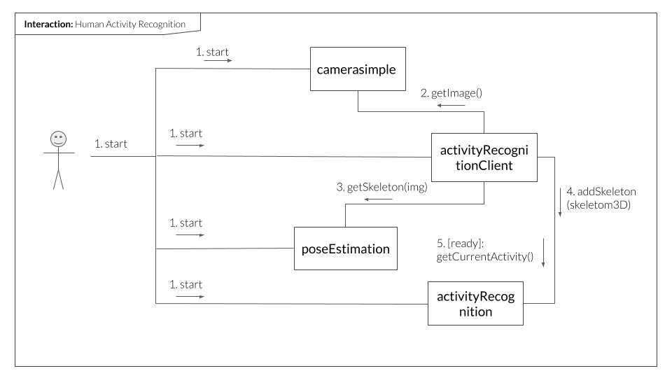

```
```
#
``` activityRecognitionClient
```
This component relies on the RGB frames from camera, which it passes to the pose estimator component and receives back the 2d and 3d joints data. It then communicates with activityRecognition component to produce predictions about the human activities and also visualizes the pose.  
Overall, the whole pipeline involves 4 components: activityRecognition, activityRecognitionClient, poseEstimation, cameraSimple. see below the communication diagram to understand the process.

## Requirements

python  
numpy  
opencv  


## Configuration parameters
As any other component,
``` *activityRecognitionClient* ```
needs a configuration file to start. In

    etc/config

Make sure that number of the port of the ports of the required interfaces match the endpoints in the config fles of the respective required interfaces.

    
## Starting the component

To run the code from activityRecognitionClient directory:

```shell
python src/activityRecognitionClient.py --Ice.Config=etc/config
```

## Starting the whole group of components for Activity Recognition

run the provided shell script. It will start all 4 components involved in activity recognition

```shell
./start/sh
```

## Diagram

