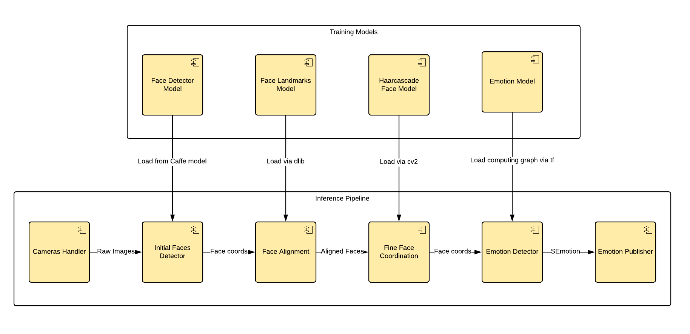

# EmotionRecognition

`EmotionRecognition` component can detect faces and recognize emotions on an image stream from any type of camera. The recognizable emotion set is **['Happy', 'Sad', 'Neutral', 'Angry', 'Surprised']**. The component utilizes `openCV` library for image processing and `tensorflow` library for training models and inference processes. The development process of this component has two phases: **Training Phase** and **Inference Pipeline**, which is shown below.



In **Training Phase**, the models mentioned in the diagram are trained ahead separably. The list below shows the model name and model file respectively:
- Face Detector Model: `assets/res10_300x300_ssd_iter_140000.caffemodel`
- Face Landmarks Model: `assets/shape_predictor_68_face_landmarks.dat`
- Haarcascade Model: `assets/haarcascade_frontalface_default.xml`
- Emotion Model: `assets/emotion_classifier.pb`

You can find the corresponding model names inside the folder `robocomp/components/robocomp-robolab/components/detection/emotionrecognition2/assets/`. For more information about training **Emotion model**, please refer to this [guide](./CNN/README.md).

In **Inference Pipeline**, the images are first streamed from a **CameraSimpleProxy** via `CameraSimple.idsl` interface. Then, the component initially detects face coordinates using the Face Detector Model (originated in file `src/face_detector.py`), note that these detected face coordinates are not perfect for Emotion Model and need more processing. The rough face coordinates are then passed to Face Alignment for aligning face based on face landmarks such as eyes, nose, mouth, etc. After that, the image is converted to grayscale for faster processing and the aligned faces are passed to Fine Face Coordination. At this time, the face images are cropped from the grayscale image and are fed in the Emotion Model to recognize emotion. Finally, the emotion tag and face coordinate pair is packed into `SEmotion` type as defined in `EmotionRecognition.idsl`, and the `SEmotion` messages are served across RoboComp.

For developer notice, the details of `EmotionRecognition.idsl` can be found in file `robocomp/interfaces/IDSLs/EmotionRecognition.idsl`.

## Resolving dependencies

This section assumes the user has already installed the RoboComp core library and pulled Robolab's components according to this [README guide](https://github.com/robocomp/robocomp).

Before using the component, the user needs to install `tensorflow` and `dlib`.
To install `tensorflow`, most of the cases you only need to type in:
```
pip install tensorflow
```
However, if some errors happen, please consult on the [TensorFlow installation guide](https://www.tensorflow.org/install/pip).

To install `dlib`:
```
pip install dlib
```

## Configuration parameters

As an example, `EmotionRecognition` component parameters are characterized in the config file described below:

```
# Endpoints for implemented interfaces
EmotionRecognition.Endpoints=tcp -p 10006


# Proxies for required interfaces
CameraSimpleProxy = camerasimple:tcp -h localhost -p 10005


# This property is used by the clients to connect to IceStorm.
TopicManager.Proxy=IceStorm/TopicManager:default -p 9999


Ice.Warn.Connections=0
Ice.Trace.Network=0
Ice.Trace.Protocol=0
Ice.ACM.Client=10
Ice.ACM.Server=10
```
The `CameraSimpleProxy` parameter specifies the TCP/IP link that this component will use to received the streaming images.
Note that we need to make sure the port number of the parameter `EmotionRecognition.Endpoints` is the same as the corresponding number of the client component using the `EmotionRecognition` component.

## Starting the component

To avoid changing the config file in the repository, we can copy it to the component's home directory, so changes will remain untouched by future git pulls:
```
cd ~/robocomp/components/robocomp-robolab/components/detection/emotionrecognition2/
cp etc/config etc/config-run
```

After editing the new config file we can run the component:
```
python src/emotionrecognition2.py etc/config-run
```

## Known issues
