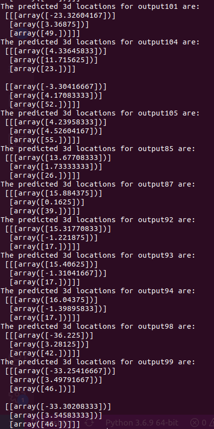

# GSOC-21-Vehicle-and-Pedestrian-Traffic-Identification

## About the Project:

The traffic monitoring project uses the data of an outdoor environment and predicts spatial occupation of obstacles like vehicle and pedestrian traffic on the road.
 
THe pipe line involes object detection and depth prediction followed by the estimation of the 3D location of the detected obstacles using the predicted metric depth and the intrinci prjection matrix.

## Setting up the environment:
The details and required verions of all the packages required are present in the "trafficMonitoring.yml" file.
Install all the required packages from the yml file and setup the environment.

## Running the project:
Inorder to ease the the execution, the entire pipeline of the codes to be run for each module are embedded into the shell script, "run.sh" (Note: The arguments must be added while running the scrip as shown below).
 
The script takes as arguments the relative folder location(no "/" at the end) where the images are present, the width and height of the images in the dataset.

   `run.sh ./imgs 1920 1080`

 
The predicted positions are printed and also saved in the "results" directory for each image as .npy file.
 

