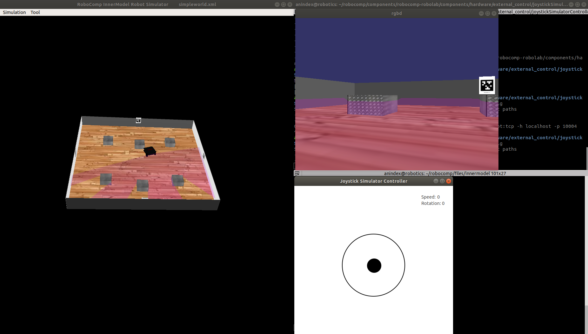

# JoystickSimulatorController

`JoystickSimulatorController` component is a Python implementation for Qt GUI joystick for controlling simulated differential robots. The component just requires interactions with the Gt GUI to convert threshold values to translational and rotational velocities, in order to control differential robots via `DifferentialRobot.idsl` interface. When running the component, user can interact with Qt GUI joystick as below image to send simulated throttles:

<p align="center">
  
</p>

For detail of `DifferentialRobot.idsl` interface and its implemented component please find in `robocomp/components/robocomp-robolab/components/hardware/base/differentialrobotComp` document.

## Compiling and Installation

This section assumes the user has already installed the RoboComp core library and pulled Robolab's components according to this [README guide](https://github.com/robocomp/robocomp).. We can compile `JoystickSimulatorController` to start using the component:

```
cd ~/robocomp/components/robocomp-robolab/components/hardware/external_control/joystickSimulatorController/
cmake .
make
```

## Configuration parameters
`JoystickSimulatorController` component parameters are characterized as the `etc/config` file described below:

```
# Proxies for required interfaces
DifferentialRobotProxy = differentialrobot:tcp -h localhost -p 10004


# This property is used by the clients to connect to IceStorm.
TopicManager.Proxy=IceStorm/TopicManager:default -p 9999


Ice.Warn.Connections=0
Ice.Trace.Network=0
Ice.Trace.Protocol=0
Ice.ACM.Client=10
Ice.ACM.Server=10
```

For sending control signals to target robot, please input valid proxy hostname and port number (e.g `localhost` and `10004`) in parameter `DifferentialRobotProxy`.

## Starting the component

To see the effect of Qt GUI joystick on the simulated differential robot on [RCIS](https://github.com/robocomp/robocomp#testing-the-installation-using-the-rcis-robotics-simulator), we suggest that user should run the RCIS simulator first:

```
cd ~/robocomp/files/innermodel
rcis simpleworld.xml
```

Next, open another terminal, we can run our Qt GUI joystick. To avoid changing the config file in the repository, we can copy it to the component's home directory, so changes will remain untouched by future git pulls:
```
cd ~/robocomp/components/robocomp-robolab/components/hardware/external_control/joystickSimulatorController/
cp etc/config etc/config-run
```

After editing the new config file we can run the component:
```
python src/joystickSimulatorController.py etc/config-run
```
## Known issues
